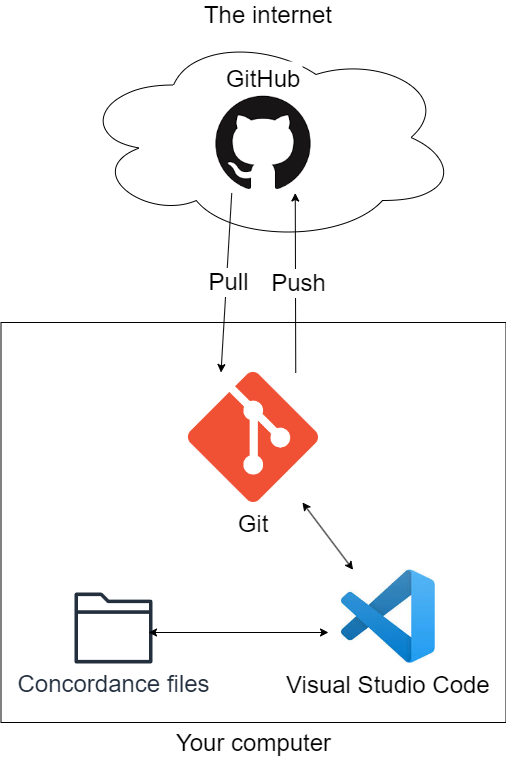

# Editing Environment Setup

The environment for editing the concordance files is shown below.

The pieces that make up this environment are discussed below.

## Git

[Git](https://git-scm.org/) is the version control system used for tracking the changes to the concordance files.

To install Git:

- Go to [Git - Downloads](https://git-scm.com/downloads) and download the git installer.
- Run the git installer and accept the default for all the options presented except:
  - When prompted for the editor to use select Visual Studio Code.

## GitHub

[GitHub](https://github.com/) serves as the origin of the git repository used for the project files.

To setup GitHub:

- Create a GitHub account at https://github.com/signup.

??? Provide your GitHub username to NCBS to be added as a collaborator to the Swedenborg Concordance repository.

## Visual Studio Code

Visual Studio Code is the recommended editor to use for editing the  project files. See [Visual Studio Code setup](vscode-setup.md) for instructions on installing and configuring Visual Studio Code.
