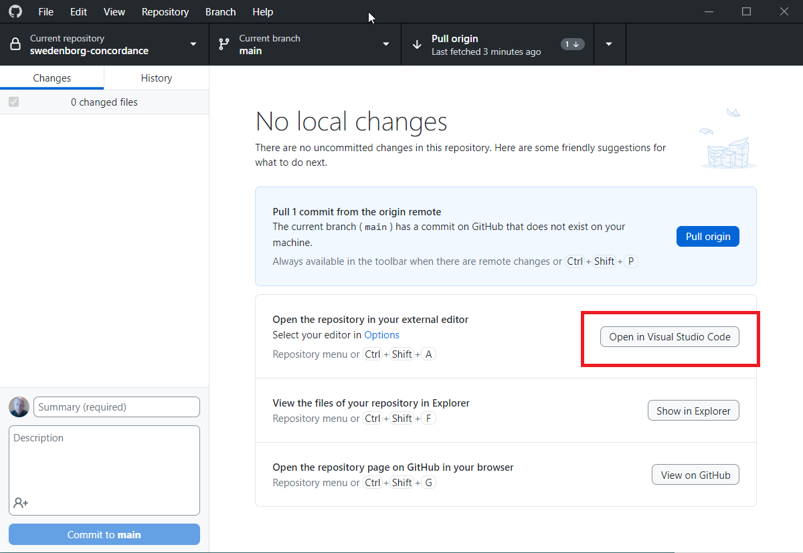

# GitHub Desktop Setup

## Create a GitHub account

If you do not already have a GitHub account, create one by opening a web browser and going to https://github.com/signup to create an account.

## Installing and setting up GitHub Desktop

1. Go to https://desktop.github.com/, download and run the installer.

    - _Note: On Macs, double-click on the the download and then drag the resulting `GitHub Desktop` file into your Applications directory to complete the installation._

1.  On the "Welcome to GitHub Desktop" page select the "Sign in to GitHub.com" button. This will take you to a browser where you can sign in.

1. On the "Configure Git" page select the "Configure manually " option to use your full name (so it can readily identified who made the changes) and your normal email address. Select "Finish"

1. Under Options (or Settings on a Mac), go to  Integrations and select Visual Studio Code as the external editor to use if it's not already selected.

1. Select "Clone a repository from the Internet..."

1. "On the Clone a repository" select the URL tab at the top of the page and enter `https://github.com/New-Christian-Bible-Study/swedenborg-collateral-literature.git`.

1. Verify that the local path is suitable.

1. Select the Clone button to place the repository under `Documents/GitHub` folder.

You should now be able to open the collateral-literature repository by selecting "Open in Visual Studio Code" as shown below.

