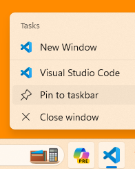
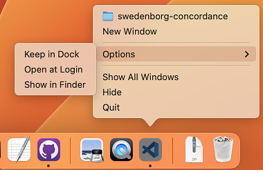
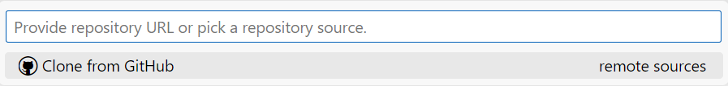
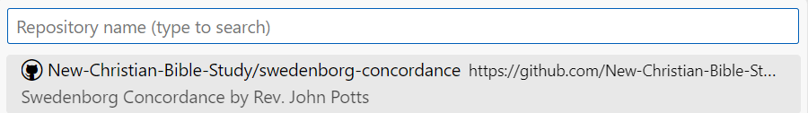
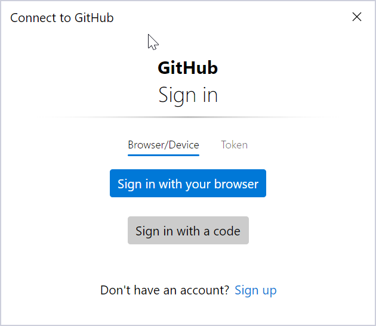
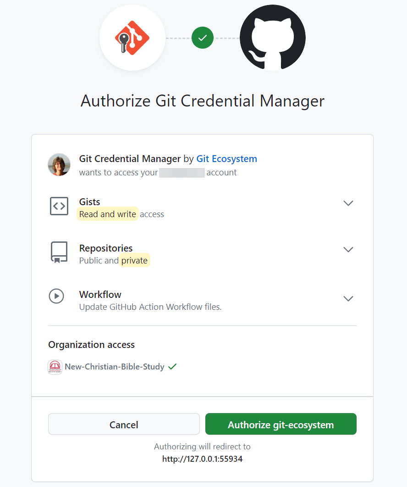

# Visual Studio Code Setup

Although the concordance files are just plain text files editable using any text editor, we recommend using [Visual Studio Code](https://code.visualstudio.com/). Doing so provides two main benefits:

- Using the [Code Spell Checker](https://marketplace.visualstudio.com/items?itemName=streetsidesoftware.code-spell-checker) extension allows the following dictionaries to be used for spelling checking:

  - a dictionary for uncommon English words used in translations of Swedenborg's works
  - a dictionary of Latin words used by Swedenborg
  - a dictionary of abbreviation of Swedenborg's works.

  This helps avoid encountering spelling error false positives.

- Using the [Swedenborg Concordance Language](https://marketplace.visualstudio.com/items?itemName=new-christian-bible-study.swconcord) extension allows color highlighting to be applied to make the article principal words, references to Swedenborg's works, and invalid constructs stand out.

## Installing Visual Studio Code

1. Visit https://code.visualstudio.com/download and download and install Visual Studio Code.
   - _Note: On Macs, double-click on the the download and then drag the resulting `Visual Studio Code.app` file into your Applications directory to complete the installation._
1. Launch Visual Studio Code
1. It is recommended to pin the Visual Studio Code icon on the taskbar (or dock for Mac) to quickly re-launch it in the future:
- For Windows, right-click on the icon and selecting "Pin to taskbar"</p>

- For Mac, hold down on the `Control` key while clicking on the icon and select "Keep in Dock:</p>


4. Go to [Swedenborg Concordance Editing Extensions](https://marketplace.visualstudio.com/items?itemName=new-christian-bible-study.swedenborg-concordance-editing-extensions) and select the Install button to install the extension. (Your browser will ask if you want to open Visual Studio Code when installing an extension. Indicate that you do.) This extension will automatically install the extensions below.

| Extension                                                                                                                  | Purpose                                                                  |
| -------------------------------------------------------------------------------------------------------------------------- | ------------------------------------------------------------------------ |
| [Code Spell Checker](https://marketplace.visualstudio.com/items?itemName=streetsidesoftware.code-spell-checker)            | Used for spelling checking of .swconcord files                           |
| [Swedenborg Concordance Language](https://marketplace.visualstudio.com/items?itemName=new-christian-bible-study.swconcord) | Provides syntax highlighting of .swconcord files                         |
| [vscode-pdf](https://marketplace.visualstudio.com/items?itemName=tomoki1207.pdf)                                           | Allows Concordance scans to be viewed directly inside Visual Studio Code |
| [Edit csv](https://marketplace.visualstudio.com/items?itemName=janisdd.vscode-edit-csv)                                    | Allows .csv (comma separated variable) files to be edited as a table     |

## Setting up to edit concordance files

Now that you have all the tools in place you'll need to get set up to be able to start editing the concordance files.

### Configure git with your user information

Before you can push your changes to GitHub you'll need to configure git with your name and email:

1. In Visual Studio Code open a terminal by selecting menu item Terminal -> New Terminal.
1. Click anywhere inside the terminal.
1. Enter the following, replacing `John Doe` with your name, and press Enter.

```
git config --global user.name "John Doe"
```

4.  Enter the following, replacing `johndoe@example.com` with your email address, and press Enter.

```
git config --global user.email johndoe@example.com
```

### Clone the concordance repository

A _clone_ of the swedenborg-concordance git repository onto your computer needs to be made.

1. Select the menu item View -> Command Palette...
1. Enter `Git: Clone`.
1. Click the `Clone from GitHub` shown below.



4. Click the swedenborg-concordance repository shown below.



5. You'll be asked to sign in to GitHub as shown below.
6. Click `Sign in with your browser`



7. On the `Authorize Git Credential Manager` page click `Authorize git-ecosystem`:



8. Visual Studio Code will then ask you to select the parent folder of the swedenborg-concordance folder that will be created. Select any folder, such as Documents, for the parent folder.
1. After the cloning is done you'll be asked "Would you like to open the cloned repository?". Select Yes.

You should now be able to edit the concordance files.
